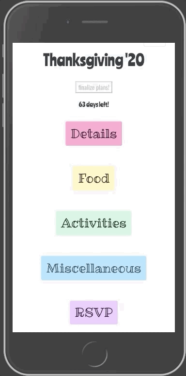
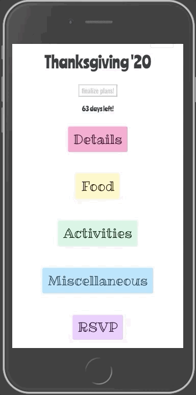
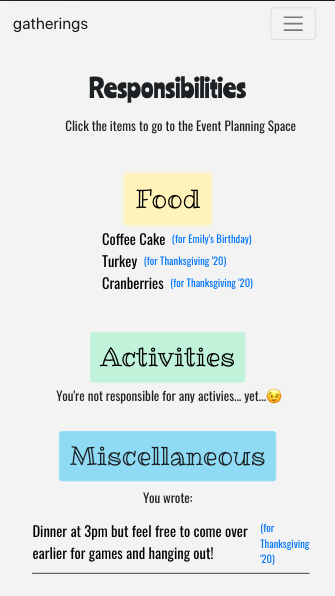
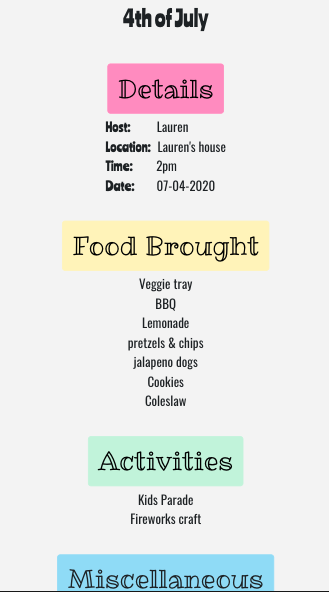
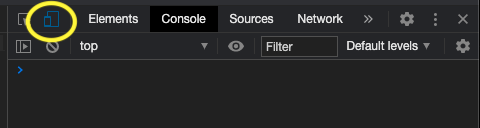

# Welcome to Gatherings!

> a collaborative event planning app

## The Idea

As my family has gotten larger, events have become more collaborative instead of having one host dictating the details of an event. We usually use group chats to plan, but I have found that to be Inefficient and confusing. What if there was a way for us to collaborate and chat about planning all in one place!

## Features

This app allows a group of people to plan events together. <br />
Features include:
* Any user can create an event to begin planning
* Any user can sign up to bring any type of items
* A responsibilities page that shows the user the items they signed up to bring
* A Finalize Plans button that is disabled until the day of the event
* The Finalize Plans button archives the event that users can see a summary of on the Archives page

## GIFs
|  |  |  |  |
| :---: | :---: | :---: | :---: |
| Details | Food | Activities and Misc | RSVP |

## PICs
|  |  
| :---: | :---: |
| the user's responsibilities for each event | archived event summary page |


## Setup
1. Clone this repository
2. ```cd``` into the directory
3. Install the necessary packages:
* ```npm install```
* ```npm i --save react react-dom react-router-dom reactstrap```
* ```npm i --save bootstrap```
* ```npm install json-server```
4. ```mkdir api``` and ```touch database.json``` to create the database
5. Copy and paste sample api below into the database
6. Run ```json-server -w database.json -p 8088``` from the api directory
7. In a separate terminal, run ```npm start``` from the repository directory
8. This app was designed for phone screens so in your browser window press cmd + opt + j (Macs) or ctrl + shift + j (Windows) to open Dev Tools and click Toggle Device Toolbar (pictured below) to change browswer view

 

## Sample API

You can copy + paste sample data to get an idea of how it can be used or the empty data to try it out from scratch!
***Event Type "other" HAS to have "id":6***

### Empty Data
                {
                   "events": [],
                   "eventTypes": [
                     {
                        "id": 1,
                        "type": "Birthday"
                     },
                     {
                        "id": 2,
                        "type": "Easter"
                     },
                     {
                        "id": 3,
                        "type": "4th of July"
                        },
                     {
                        "id": 4,
                        "type": "Thanksgiving"
                     },
                     {
                        "id": 5,
                        "type": "Christmas"
                     },
                     {
                        "id": 6,
                        "type": "Other"
                     }
                  ],
                   "users": [],
                   "userEvents": [],
                   "food":[],
                   "misc":[],
                   "activities": [],
                   "foodTypes": []
                }

### Sample Data
<details><summary>Click for Sample Data</summary>
<p>

```
{
   "events": [    
      {
         "name": "Jane's Birthday",
         "eventTypeId": 1,
         "date": "2020-12-11",
         "host": "click edit",
         "location": "to add",
         "time": "details!",
         "archived": false,
         "id": 1
      },
      {
         "id": 2,
         "name": "4th of July",
         "eventTypeId": 3,
         "date": "2020-07-04",
         "host": "Jane",
         "location": "Jane's house",
         "time": "2pm",
         "archived": true
      }
   ],
   "eventTypes": [
      {
         "id": 1,
         "type": "Birthday"
      },
      {
         "id": 2,
         "type": "Easter"
      },
      {
         "id": 3,
         "type": "4th of July"
         },
      {
         "id": 4,
         "type": "Thanksgiving"
      },
      {
         "id": 5,
         "type": "Christmas"
      },
      {
         "id": 6,
         "type": "Other"
      }
   ],
   "users": [
      {
         "email": "emily@emily.com",
         "password": "123",
         "fname": "Jane",
         "lname": "Doe",
         "id": 1
      }
   ],
   "userEvents": [
      {
         "id": 1,
         "userId": 1,
         "eventId": 1,
         "rsvp": true
      },
      {
         "id": 2,
         "userId": 1,
         "eventId": 2,
         "rsvp": true
      }
   ],
   "food":[],
   "misc":[],
   "activities": [],
   "foodTypes": [
      {
         "id": 1,
         "type": "Main"
      },
      {
         "id": 2,
         "type": "Sides"
      },
      {
         "id": 3,
         "type": "Dessert"
      },
      {
         "id": 4,
         "type": "Drinks"
      },
      {
         "id": 5,
         "type": "Snacks"
      }
   ]
}
```

</p>
</details>

## Author

Emily Hartzell - [GitHub](https://github.com/egeehartz), [LinkedIn](www.linkedin.com/in/emilyhartzell)